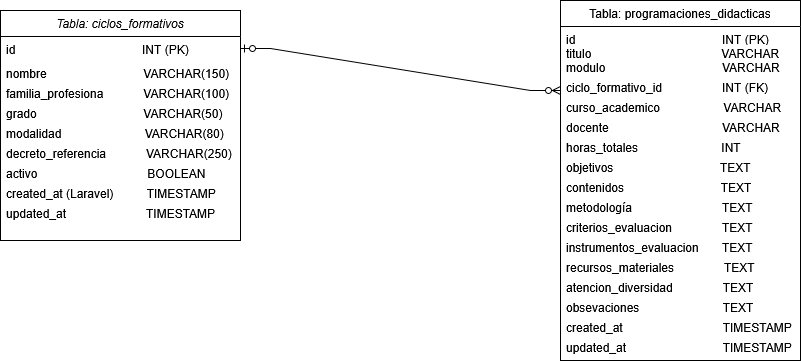

# CRUD Ciclos Formativos 

Proyecto de Aplicación web en Laravel con MySQL para la gestión de ciclos formativos del IES San Vicente Ferrer (Algemesí).

---

# Tecnologías utilizadas

Laravel 12
PHP 8
MySQL
Docker
Bootstrap 5
Blade
Git y GitHub

---

# Funcionalidades

## CRUD completo de ciclos formativos

Con esta aplicación podemos:

Crear ciclos nuevos.
Editar ciclos ya creados.
Eliminar ciclos.
Visualizar el listado de ciclos.

## Búsqueda y filtrado

Esta aplicación puede:
Buscar por nombre.
Filtrar por grado.

## Paginación

El listado utiliza Laravel Pagination para la paginación.

## Validaciones

Se han implementado validaciones mediante:
StoreCicloFormativoRequest
UpdateCicloFormativoRequest

## Seeders

Se ha creado un seeder con datos de prueba.

---
# Diseño de la Base de Datos

Para cumplir con las especificaciones del proyecto indicado en el punto 3, se ha diseñado un modelo relacional que aseura la integración de los datos y la escalabilidad.

## Diagrama Entidad-Relacion

Puedes encontrar el archivo del diagrama en la carpeta 
'docs/Diagrama_Proyecto_Rebeca_Gijon.drawio.png'.



Se ha creado la tabla 'ciclos_formativos' siguiendo las especificaciones del proyecto.

También se han incluido 'timestamps' ('created_at', 'updated_at') para el seguimiento de cambios mediante Eloquent ORM.

La tabla está preparada para recibir la relación '1:N' con las programaciones didácticas del Módulo C.


---

# Instalación del proyecto

## 1. Clonar repositorio

```bash
git clone https://github.com/rgijon/programaciones-didacticas.git
```

## 2. Entrar al proyecto

```bash
cd programaciones-didacticas
```

## 3. Ejecutar Docker

```bash
docker compose up -d
```

## 4. Entrar en el contenedor

En otro terminal, ejecutar:
```bash
docker exec -it laravel-myapp-1 bash
```

## 5. Ejecutar migraciones y seeder

```bash
php artisan migrate:fresh --seed
```

# Rutas principales

 /ciclos        -> Listado de ciclos
 /ciclos/create -> Crear ciclo

# Estructura del proyecto

CicloFormativoController

# Modelo

CicloFormativo

# Views

template.blade.php
index.blade.php
create.blade.php
edit.blade.php

# Requests

StoreCicloFormativoRequest
UpdateCicloFormativoRequest

# Autor

Proyecto desarrollado por Rebeca Gijón Ayala.


